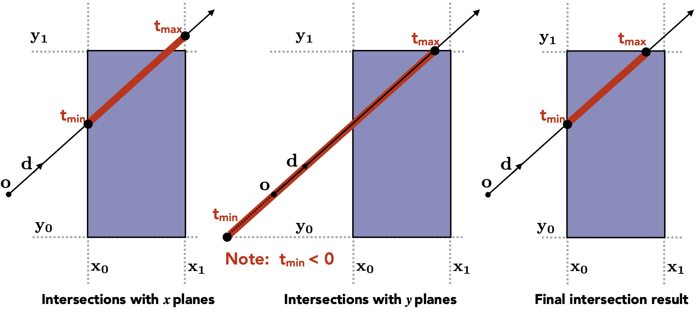
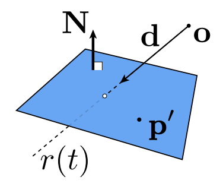
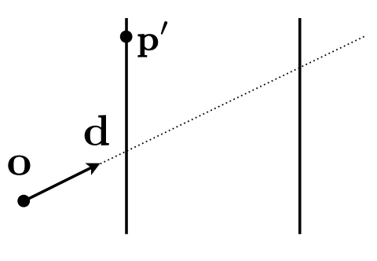

## 第四次作业补充材料

### 1. 光线追踪简介

光线追踪（Ray Tracing）是一种高级的图像渲染技术，通过模拟光线在三维场景中的传播和交互过程，生成极其逼真的图像。

在前几次的作业中，同学们接触了基于光栅化的渲染管线。对每个图元，通过几何变换和离散化的方式将其从三维空间中转换到屏幕坐标下。而光线追踪与此相反，它从观察者（摄像机）的视角出发，沿着每个像素发射光线，追踪这些光线与场景中物体的交互过程。

与传统的光栅化渲染相比，光线追踪能够更精确地模拟光线的物理行为（如镜面反射、间接光照、软阴影等），从而创造出更加真实的视觉效果。

在本次作业中，要求同学们实现以下功能：

- 计算由漫反射材质（Diffuse Materials）和自发光材质（Emissive Materials）得到的光线颜色；
- 实现球体（Sphere）、四边形（Quadrilateral）和均匀介质（Constant Density Mediums）等三维物体的碰撞计算，实现球体的运动模糊；
- 通过包围盒（Bounding Box）和BVH树（Bounding Volume Hierarchy）加速碰撞的计算。

### 2. 光线颜色计算

### 3. 碰撞计算

### 4. 加速算法

#### AABB（Axis-Aligned Bounding Box）

很多几何物体（如球面）求交计算的代价是很大的，我们可以通过包围盒（Bounding Box）来加速计算。利用一个包围盒包住物体，在与该物体的表面计算求交之前先判断光线是否与包围盒相交，如果光线与包围盒没有交点的话，自然不会与物体有交点。

AABB（Axis-Aligned Bounding Box，轴对齐包围盒）是一种包围盒，它的六个面都与坐标轴平行。在轴对齐的情况下，与光线的求交如下图所示：

对任意平面，我们求交需要3次减法、6次乘法和1次除法：

$$ t = \frac{(p - o)\cdot N}{d} $$

而对轴对齐的某对平面，我们只需要1次减法和1次除法：

$$ t = \frac{p - o}{d} $$

在已经提供的代码中，每个继承了`Hittable`类的碰撞体都有一个AABB成员，用于实现`bounding_box()`函数。AABB成员在构造函数中初始化。值得一提的是，我们可以很容易地将多个AABB合并为一个更大的AABB。

#### BVH（Bounding Volume Hierarchy）

对一个复杂场景而言，即使已经使用了AABB，遍历空间中的所有物体进行计算是很慢的。我们需要通过一定的方法对空间中的物体进行划分，将求交的计算复杂度降低到对数级别。

通常我们会按照空间或者物体两种方式进行划分

### 参考资料

- [GAMES101 Lecture 13-16 Ray Tracing](https://www.bilibili.com/video/av90798049?vd_source=d0f1f4e3b1f1759e459bad8718d772f4&p=13&spm_id_from=333.788.videopod.episodes)

- [Ray Tracing in One Weekend Book Series](https://raytracing.github.io/)