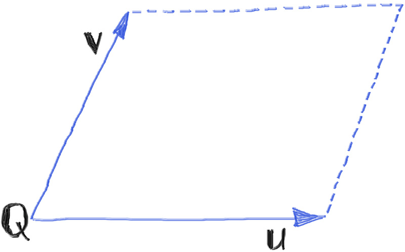
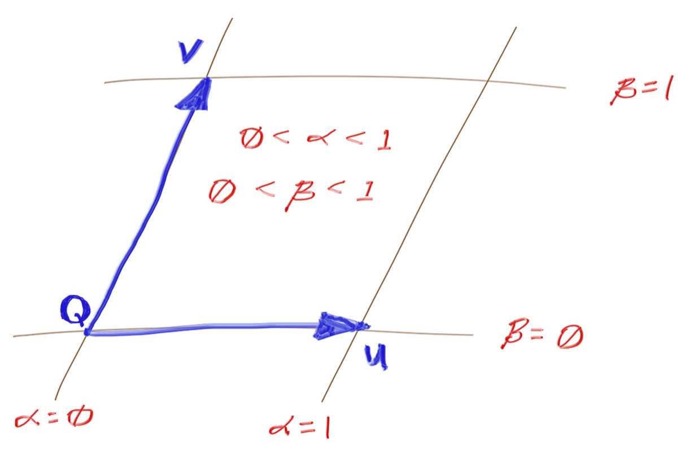
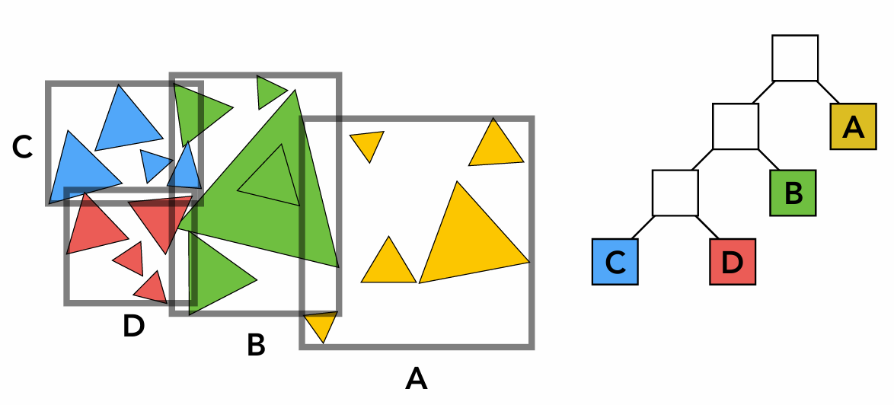
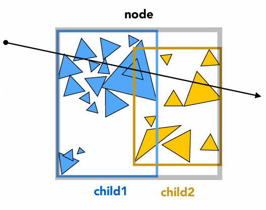

## 第四次作业补充材料

### 1. 光线追踪简介

光线追踪（Ray Tracing）是一种高级的图像渲染技术，通过模拟光线在三维场景中的传播和交互过程，生成极其逼真的图像。

在前几次的作业中，同学们接触了基于光栅化的渲染管线。对每个图元，通过几何变换和离散化的方式将其从三维空间中转换到屏幕坐标下。而光线追踪与此相反，它从观察者（摄像机）的视角出发，沿着每个像素发射光线，追踪这些光线与场景中物体的交互过程。

与传统的光栅化渲染相比，光线追踪能够更精确地模拟光线的物理行为（如镜面反射、间接光照、软阴影等），从而创造出更加真实的视觉效果。

在本次作业中，要求同学们实现以下功能：

- 计算由漫反射材质（Diffuse Materials）和自发光材质（Emissive Materials）得到的光线颜色；
- 实现球体（Sphere）、四边形（Quadrilateral）和均匀介质（Constant Density Mediums）等三维物体的求交计算，实现球体的运动模糊；
- 通过包围盒（Bounding Box）和BVH树（Bounding Volume Hierarchy）加速求交的计算。

### 2. 光线颜色计算

#### 材质（Materials）

在光线追踪中，材质是描述物体表面性质的重要概念。不同的材质会对光线的传播和交互产生不同的影响。

在我们的作业中，定义了`Material`类，所有的材质都继承自这个类。

```cpp
class Material {
public:
    virtual ~Material() = default;

    virtual vecf3 emitted(double u, double v, const vecf3& p) const {
        return vecf3(0, 0, 0);
    }

    virtual bool scatter(const Ray& r_in, const Record& rec, vecf3& attenuation, Ray& scattered) const {
        return false;
    }
};
```

其中`emitted`函数返回自发光材质的颜色，`scatter`函数返回漫反射材质的散射情况。

`Lambertian`是一种最基本的漫反射材质，其纹理（Texture）是一个均匀固定的颜色或一张纹理贴图。在计算散射时，我们随机生成一个单位向量，然后将其与法向量相加，得到散射方向。然后计算散射的光线和颜色。`attenuation`表示光线的衰减（或混合），在`Lambdaian`中总是成功散射，光线直接与物体颜色纹理相乘即可得到最终颜色。

```cpp
class Lambertian : public Material {
public:
    bool scatter(const Ray& r_in, const Record& rec, vecf3& attenuation, Ray& scattered) const override {
        vecf3 scatter_direction = rec.normal + random_unit_vector();

        // Catch degenerate scatter direction
        if (scatter_direction.isZero(1e-8)) {
            scatter_direction = rec.normal;
        }

        scattered = Ray(rec.p, scatter_direction, r_in.time);
        attenuation = tex->value(rec.u, rec.v, rec.p);
        return true;
    }

private:
    std::shared_ptr<Texture> tex;
};
```

`Metal`是金属材质，其表面是高度反射的。在计算散射时，我们先计算反射方向，然后加上一个随机的偏移量，使得反射光线有一定的模糊度。`fuzz`参数控制模糊度，`albedo`参数控制金属的颜色。

```cpp
class Metal : public Material {
public:
    bool scatter(const Ray& r_in, const Record& rec, vecf3& attenuation, Ray& scattered) const override {
        vecf3 reflected = reflect(r_in.direction, rec.normal);
        reflected = unit_vector(reflected) + (fuzz * random_unit_vector());
        scattered = Ray(rec.p, reflected, r_in.time);
        attenuation = albedo;
        return (scattered.direction.dot(rec.normal) > 0);
    }

private:
    vecf3 albedo;
    double fuzz;
};
```

`Dielectric`是介质材质，其表面是半透明的。在计算散射时，我们先计算折射方向，然后根据反射率决定是反射还是折射。`refraction_index`参数表示介质的折射率。

```cpp
class Dielectric : public Material {
public:
    bool scatter(const Ray& r_in, const Record& rec, vecf3& attenuation, Ray& scattered) const override {
        attenuation = vecf3(1.0, 1.0, 1.0);
        double ri = rec.front_face ? (1.0/refraction_index) : refraction_index;

        vecf3 unit_direction = unit_vector(r_in.direction);
        double cos_theta = std::fmin(-unit_direction.dot(rec.normal), 1.0);
        double sin_theta = std::sqrt(1.0 - cos_theta*cos_theta);

        bool cannot_refract = ri * sin_theta > 1.0;
        vecf3 direction;

        if (cannot_refract || reflectance(cos_theta, ri) > random_double())
            direction = reflect(unit_direction, rec.normal);
        else
            direction = refract(unit_direction, rec.normal, ri);

        scattered = Ray(rec.p, direction, r_in.time);
        return true;
    }

private:
    double refraction_index;
};
```

`Isotropic`是各向同性材质，其表面是均匀的。在计算散射时，我们随机生成一个单位向量，得到散射方向。`tex`参数表示材质的颜色，一般是一个固定的颜色纹理。

```cpp
class Isotropic : public Material {
public:
    bool scatter(const Ray& r_in, const Record& rec, vecf3& attenuation, Ray& scattered) const override {
        scattered = Ray(rec.p, random_unit_vector(), r_in.time);
        attenuation = tex->value(rec.u, rec.v, rec.p);
        return true;
    }

private:
    std::shared_ptr<Texture> tex;
};
```

`DiffuseLight`是自发光材质，其表面会发光。我们不考虑其散射，而是计算其发出的光线颜色。

```cpp
class DiffuseLight : public Material {
public:
    vecf3 emitted(double u, double v, const vecf3& p) const override {
        return tex->value(u, v, p);
    }

private:
    std::shared_ptr<Texture> tex;
};
```

#### 递归计算光线颜色

在`camera.cpp`中规定了4.2需要实现的部分，传入参数：
- `r`：光线
- `depth`：递归深度
- `world`：场景中可与光线相交的物体（列表）

我们可以通过这些信息，结合求交过程中记录的物体材质信息，计算漫反射和自发光求得的光线颜色。计算过程如下：

```cpp
vecf3 Camera::ray_color(const Ray& r, int depth, const Hittable& world) const {
    // 达到递归深度上限
    if (depth <= 0)
        return vecf3(0, 0, 0);

    Record rec;

    // 1) 判断world是否与r相交，如果不相交则返回背景颜色
    if (!world.hit(r, interval(0.001, infinity), rec)) {
        return background;
    }

    // 2) 直接计算自发光材质的颜色

    // 3) 判断是否散射，并得到散射光线和衰减颜色
    if (不发生散射) {
        return 自发光的颜色;
    }

    // 4) 如果发生散射
    散射颜色 = 衰减颜色 * 递归计算下一条光线的颜色;

    return 散射颜色 + 自发光的颜色;
}
```

### 3. 求交计算

#### 光线与球体的求交

光线追踪的核心是求解光线与场景中物体的交点。我们将光线表示为：

$$ \mathbf{r}(t) = \mathbf{O} + t\mathbf{d} $$

其中 $\mathbf{O}$ 是光线的原点（Origin），$\mathbf{d}$ 是光线的方向（Direction），$t$ 是光线的行程参数（也可以理解为时间）。

我们可以用下面的方程表示一个以原点为中心、半径为 $r$ 的球体：

$$ x^2 + y^2 + z^2 = r^2 $$

如果我们让球心在任意点 $(C_x, C_y, C_z)$，那么方程变为：

$$ (C_x - x)^2 + (C_y - y)^2 + (C_z - z)^2 = r^2 $$

我们将公式表示为点乘的形式：

$$ (\mathbf{C} - \mathbf{P}) \cdot (\mathbf{C} - \mathbf{P}) = r^2 $$

我们可以将这个方程理解为“满足这个方程的任意点 $\mathbf{P}$ 都在球体上”。我们想知道光线 $ \mathbf{r}(t) = \mathbf{O} + t\mathbf{d} $ 是否与球体相交。如果光线与球体相交，那么存在某个 $t$ 使得 $\mathbf{r}(t)$ 满足球体方程。因此令$ \mathbf{P} = \mathbf{r}(t) $：

$$ (\mathbf{C} - \mathbf{r}(t)) \cdot (\mathbf{C} - \mathbf{r}(t)) = r^2 $$

即：

$$ (\mathbf{C} - (\mathbf{O} + t\mathbf{d})) \cdot (\mathbf{C} - (\mathbf{O} + t\mathbf{d})) = r^2 $$ 

展开并移项，得到一个关于 $t$ 的二次方程：

$$ t^2 \mathbf{d} \cdot \mathbf{d} - 2t \mathbf{d} \cdot (\mathbf{C} - \mathbf{O}) + (\mathbf{C} - \mathbf{O}) \cdot (\mathbf{C} - \mathbf{O}) - r^2 = 0 $$

我们可以通过求根公式解出 $t$ 的值，解的数量表示光线与球体的相交情况。需要注意的是，由于光线是一条射线，真正的交点是在 $t$ 大于0的情况下，值最小的 $t$。

我们可以略微简化求根的计算：

$$ \frac{-b \pm \sqrt{b^2 - 4ac}}{2a}  = \frac{-(-2h) \pm \sqrt{(-2h)^2 - 4ac}}{2a} = \frac{h \pm \sqrt{h^2 - ac}}{a} $$

$h$ 的表示比 $b$ 更简单：

$$ h = \frac{b}{-2} = \mathbf{d} \cdot (\mathbf{C} - \mathbf{O}) $$

因此，我们可以通过下面的代码计算光线与球体的交点：

```cpp
bool Sphere::hit(const Ray& r, Interval ray_t, Record& rec) const {
    vecf3 current_center = center.at(0); // 后面会解释这里这么做的原因
    vecf3 oc = current_center - r.origin;
    auto a = r.direction.squaredNorm();
    auto h = r.direction.dot(oc);
    auto c = oc.squaredNorm() - radius * radius;

    auto discriminant = h * h - a * c;

    // 没有实数根，光线与球体不相交
    if (discriminant < 0) {
        return false;
    }

    auto sqrtd = std::sqrt(discriminant);

    // 找到最近、且在光线范围内的交点
    auto root = (h - sqrtd) / a;
    if (!ray_t.surrounds(root)) {
        root = (h + sqrtd) / a;
        if (!ray_t.surrounds(root)) {
            return false;
        }
    }

    rec.t = root;           // 记录交点的t值
    rec.p = r.at(rec.t);    // 记录交点的位置

    // 计算法向量
    vecf3 outward_normal = (rec.p - current_center) / radius;
    rec.set_face_normal(r, outward_normal);
    
    // 计算纹理坐标, 用于纹理贴图
    get_sphere_uv(outward_normal, rec.u, rec.v);
    
    // 记录材质
    rec.mat = mat;

    return true;
}
```

#### 光线与四边形（Quadrilateral）的求交

我们将四边形定义为：
1. 点 $\mathbf{Q}$ 是四边形的一个角；
2. 向量 $\mathbf{u}$ 表示第一条边，$\mathbf{Q} + \mathbf{u}$ 是与 $\mathbf{Q}$ 相邻的一个角；
3. 向量 $\mathbf{v}$ 表示第二条边，$\mathbf{Q} + \mathbf{v}$ 是与 $\mathbf{Q}$ 相邻的另一个角。

对角可以表示为 $\mathbf{Q} + \mathbf{u} + \mathbf{v}$（其实是个平行四边形）。



对于光线和四边形的求交，我们可以先求出四边形所在平面和光线的交点，然后判断交点是否在四边形内部。

我们使用点法式，用$\mathbf{n}$表示平面的法向量，$\mathbf{v}$表示平面上任意一点：

$$ \mathbf{n} \cdot \mathbf{v} = D $$

同样是带入光线方程，我们可以得到：

$$ \mathbf{n} \cdot (\mathbf{O} + t\mathbf{d}) = D $$

解出：

$$ t = \frac{D - \mathbf{n} \cdot \mathbf{O}}{\mathbf{n} \cdot \mathbf{d}} $$

在构造函数中，我们已经通过叉乘得到了法向量，并利用$\mathbf{Q}$本身作为平面上的一个点，计算出了$D$。

我们已经解出了交点$\mathbf{P}$，现在我们需要判断$\mathbf{P}$是否在四边形内部。我们可以通过坐标系变换来判断：

$$ \mathbf{P} = \mathbf{Q} + \alpha \mathbf{u} + \beta \mathbf{v}$$
$$ \mathbf{p} = \mathbf{P} - \mathbf{Q} = \alpha \mathbf{u} + \beta \mathbf{v} $$

中间过程不作展开，我们可以得到新坐标系下的$\alpha$和$\beta$的表达式：

$$ \alpha = \frac{\mathbf{n} \cdot (\mathbf{p} \times \mathbf{v})}{\mathbf{n} \cdot (\mathbf{u} \times \mathbf{v})} $$

$$ \beta = \frac{\mathbf{n} \cdot (\mathbf{u} \times \mathbf{p})}{\mathbf{n} \cdot (\mathbf{u} \times \mathbf{v})} $$

我们在构造函数中还保留了一个值$w$：

$$ \mathbf{w} = \frac{\mathbf{n}}{\mathbf{n} \cdot \mathbf{n}} = \frac{\mathbf{n}}{\mathbf{n} \cdot (\mathbf{u} \times \mathbf{v})} $$

最后得到：

$$ \alpha = \mathbf{w} \cdot (\mathbf{p} \times \mathbf{v}) $$
$$ \beta  = \mathbf{w} \cdot (\mathbf{u} \times \mathbf{p}) $$



最后通过判断$\alpha$和$\beta$是否在$[0, 1]$之间，我们可以判断交点是否在四边形内部。

```cpp
bool Quad::hit(const Ray& r, Interval ray_t, Record& rec) const {
    // TODO: 4.3 Quad & ray intersection

    // 1) 计算平面与光线的交点

    // 2) 判断交点是否在四边形内部
    if (交点不在四边形内部) {
        return false;
    }

    rec.t = t;              // 记录交点的t值    
    rec.p = intersection;   // 记录交点的位置
    rec.mat = mat;          // 记录材质
    rec.set_face_normal(r, normal); // 计算法向量

    return true;
}
```

得到了四边形求交的方法，我们可以通过6个正方形构成一个立方体，从而简单地完成一个立方体的求交计算。

```cpp
// Returns the 3D box (six sides) that contains the two opposite vertices a & b.
std::shared_ptr<HittableList> box(const vecf3& a, const vecf3& b, std::shared_ptr<Material> mat) {
    auto sides = std::make_shared<HittableList>();

    // TODO: Use the Quad class to create the six sides of the box.
    // `a` and `b` are the two opposite vertices of the box.

    // 你需要注意Quad类构造函数中法线的方向计算
    // 你可以通过sides->add(std::make_shared<Quad>(...))的方式将构造的四边形加入到sides中，std::make_shared<Quad>(...)的参数请参考Quad类的构造函数

    return sides;
}
```

#### 光线与均匀介质（Constant Mediums）的求交

我们考虑一个密度恒定的空间物体。光线可以在物体内部散射，也可以穿透物体。光线在物体内部，每经过$\Delta L$的距离，发生散射的概率为：

$$ \mathit{probability} = C \cdot \Delta L $$

其中 $C$ 与体积的光密度成正比。光密度值表示光进入介质前的光强$l_0$与光通过介质后的光强$l$的比值，可以得到：

$$ L = \frac{\log{l_0/l_1}}{C} $$

方便起见我们将$\log{l_0/l_1}$表示为$-\log{l_1/l_0}$，以限定在$[0, 1]$之间，即：

$$ L = -\frac{1}{C} \log{r} $$

我们简单地将$r$用一个随机数表示，计算得到光线在介质内部的距离。

在构造函数中，我们用一个`Hittable`类型的对象表示这个均匀介质的边界。我们可以先求出沿光线方向的两个交点，然后判断光线是否在介质内部。

```cpp
bool ConstantMedium::hit(const Ray& r, Interval ray_t, Record& rec) const {
    // TODO: 4.3 Constant Medium & ray intersection

    // 1) 计算光线与介质的两个交点
    // 注意取值和大小的判断

    // 2) 计算光线在介质内部的距离
    // 利用 random_double() 生成0~1之间的随机数

    // 3) 判断光线是否在介质内部发生了散射
    if (光线在介质内部的距离 > 两个交点之间的距离) {
        return false;
    }

    // 记录交点的t值
    // 记录交点的位置

    rec.normal = vecf3(1,0,0);  // 任意法向量
    rec.front_face = true;      // 任意朝向
    rec.mat = phase_function;

    return true;
}
```

#### 运动模糊

你可能已经注意到了我们在`Sphere`类中使用`Ray`表示球心而不是`vecf3`。我们可以通过改变球心的位置来模拟球体的运动。

只需要简单地修改之前的实现即可：

```cpp
bool Sphere::hit(const Ray& r, Interval ray_t, Record& rec) const {
    vecf3 current_center = center.at(r.time); 

    ...
}
```

### 4. 加速算法

#### AABB（Axis-Aligned Bounding Box）

很多几何物体（如球面）求交计算的代价是很大的，我们可以通过包围盒（Bounding Box）来加速计算。利用一个包围盒包住物体，在与该物体的表面计算求交之前先判断光线是否与包围盒相交，如果光线与包围盒没有交点的话，自然不会与物体有交点。

AABB（Axis-Aligned Bounding Box，轴对齐包围盒）是一种包围盒，它的六个面都与坐标轴平行。在轴对齐的情况下，与光线的求交如下图所示：


对任意平面，我们求交需要3次减法、6次乘法和1次除法：

$$ t = \frac{(p - o)\cdot N}{d} $$


而对轴对齐的某对平面，我们只需要1次减法和1次除法：

$$ t = \frac{p - o}{d} $$


在已经提供的代码中，每个继承了`Hittable`类的求交体都有一个AABB成员，用于实现`bounding_box()`函数。AABB成员在构造函数中初始化。值得一提的是，我们可以很容易地将多个AABB合并为一个更大的AABB，取所有AABB每个轴的最小值和最大值即可。

#### BVH（Bounding Volume Hierarchy）

对一个复杂场景而言，即使已经使用了AABB，遍历空间中的所有物体进行计算是很慢的。我们需要通过一定的方法对空间中的物体进行划分，将求交的计算复杂度降低到对数级别。

本次作业中采用的方法是BVH（Bounding Volume Hierarchy，包围体层次结构）。BVH是一种二叉树结构，每个节点都有一个AABB。可以将实际的物体看作叶结点，射线与BVH结点最终是否相交的判断会递归的向下进行，直到叶结点。



判断光线与BVH树的求交过程如下（`hit.cpp` 4.3）：

```cpp
AABB BVHNode::bbox;

bool BVHNode::hit(const Ray& r, Interval ray_t, Record& rec) const {
    if (bbox与r不相交) {
        return false;
    }

    bool hit_left = 递归地判断与左BVH结点相交;
    bool hit_right = 递归地判断与右BVH结点相交;

    return hit_left || hit_right;
}
```




### 参考资料

- [GAMES101 Lecture 13-16 Ray Tracing](https://www.bilibili.com/video/av90798049?vd_source=d0f1f4e3b1f1759e459bad8718d772f4&p=13&spm_id_from=333.788.videopod.episodes)

- [Ray Tracing in One Weekend Book Series](https://raytracing.github.io/)